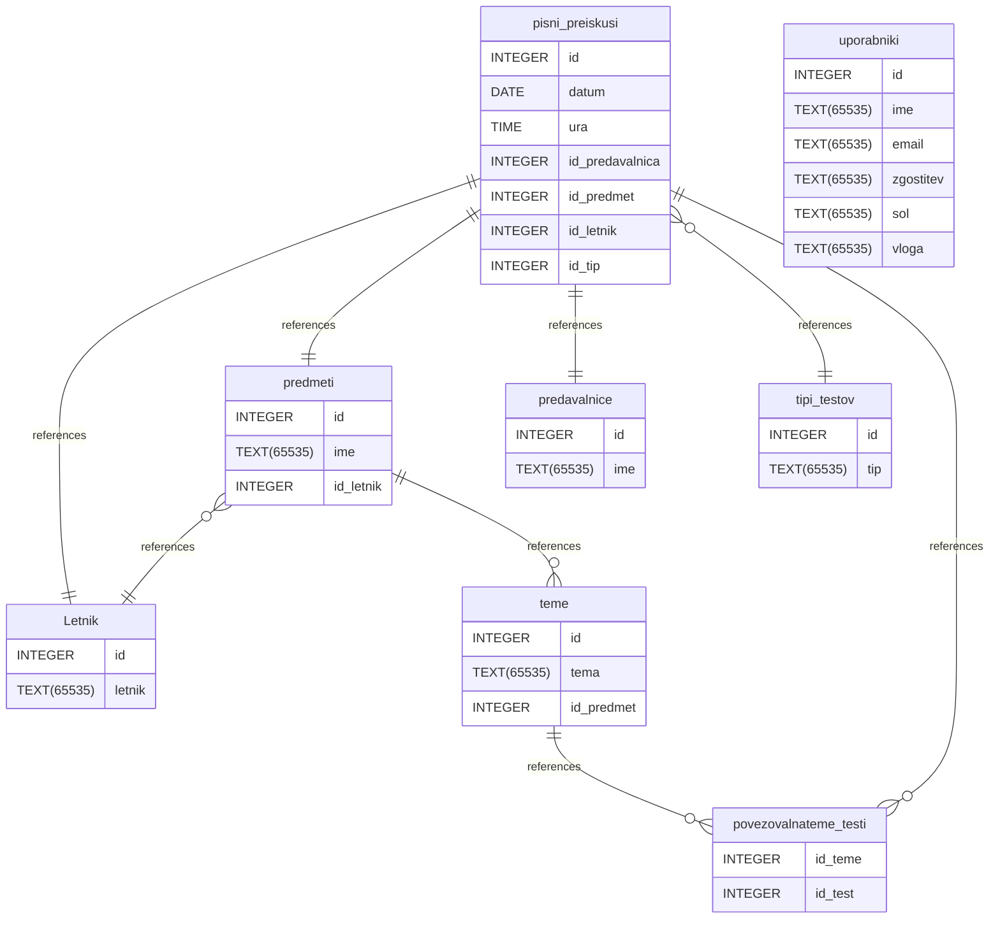

# Naslov projekta: PisniPreiskusi
## Namen projekta: Pregled in urejanje pisnih preizkusov na FMF
```
 Funkcionalnosti: dodajanje in pregled pisnih preizkusov
 Opis baze:
 # Untitled Diagram documentation
## Summary

- [Introduction](#introduction)
- [Database Type](#database-type)
- [Table Structure](#table-structure)
	- [Letnik](#letnik)
	- [predmeti](#predmeti)
	- [teme](#teme)
	- [predavalnice](#predavalnice)
	- [tipi_testov](#tipi_testov)
	- [pisni_preiskusi](#pisni_preiskusi)
	- [povezovalnateme_testi](#povezovalnateme_testi)
	- [uporabniki](#uporabniki)
- [Relationships](#relationships)
- [Database Diagram](#database-diagram)

## Introduction

## Database type

- **Database system:** SQLite
## Table structure

### Letnik

| Name       | Type        | Settings                               | References | Note |
| ---------- | ----------- | -------------------------------------- | ---------- | ---- |
| **id**     | INTEGER     | 🔑 PK, not null, unique, autoincrement |            |      |
| **letnik** | TEXT(65535) | null                                   |            |      | 


### predmeti

| Name          | Type        | Settings                               | References                  | Note |
| ------------- | ----------- | -------------------------------------- | --------------------------- | ---- |
| **id**        | INTEGER     | 🔑 PK, not null, unique, autoincrement | fk_Predmet_id_(Tema)        |      |
| **ime**       | TEXT(65535) | null                                   |                             |      |
| **id_letnik** | INTEGER     | null                                   | fk_Predmet_id_letnik_Letnik |      | 


### teme

| Name           | Type        | Settings                               | References               | Note |
| -------------- | ----------- | -------------------------------------- | ------------------------ | ---- |
| **id**         | INTEGER     | 🔑 PK, not null, unique, autoincrement | fk_(Tema)_id_povezovalna |      |
| **tema**       | TEXT(65535) | null                                   |                          |      |
| **id_predmet** | INTEGER     | null                                   |                          |      | 


### predavalnice

| Name    | Type        | Settings                               | References | Note |
| ------- | ----------- | -------------------------------------- | ---------- | ---- |
| **id**  | INTEGER     | 🔑 PK, not null, unique, autoincrement |            |      |
| **ime** | TEXT(65535) | null                                   |            |      | 


### tipi_testov

| Name    | Type        | Settings                               | References | Note |
| ------- | ----------- | -------------------------------------- | ---------- | ---- |
| **id**  | INTEGER     | 🔑 PK, not null, unique, autoincrement |            |      |
| **tip** | TEXT(65535) | null                                   |            |      | 


### pisni_preiskusi

| Name                | Type    | Settings                               | References                                  | Note |
| ------------------- | ------- | -------------------------------------- | ------------------------------------------- | ---- |
| **id**              | INTEGER | 🔑 PK, not null, unique, autoincrement | fk_Pisni_testi_id_povezovalna               |      |
| **datum**           | DATE    | null                                   |                                             |      |
| **ura**             | TIME    | null                                   |                                             |      |
| **id_predavalnica** | INTEGER | null                                   | fk_pisni_testi_id_predavalnica_Predavalnica |      |
| **id_predmet**      | INTEGER | null                                   | fk_pisni_testi_id_predmet_Predmet           |      |
| **id_letnik**       | INTEGER | null                                   | fk_pisni_testi_id_letnik_Letnik             |      |
| **id_tip**          | INTEGER | null                                   | fk_pisni_testi_id_tip_tip_testa             |      | 


### povezovalnateme_testi

| Name        | Type    | Settings    | References | Note |
| ----------- | ------- | ----------- | ---------- | ---- |
| **id_teme** | INTEGER | 🔑 PK, null |            |      |
| **id_test** | INTEGER | 🔑 PK, null |            |      | 


### uporabniki

| Name          | Type        | Settings                       | References | Note |
| ------------- | ----------- | ------------------------------ | ---------- | ---- |
| **id**        | INTEGER     | 🔑 PK, not null, autoincrement |            |      |
| **ime**       | TEXT(65535) | null                           |            |      |
| **email**     | TEXT(65535) | null, unique                   |            |      |
| **zgostitev** | TEXT(65535) | null                           |            |      |
| **sol**       | TEXT(65535) | null                           |            |      |
| **vloga**     | TEXT(65535) | null, default: student         |            |      | 


## Relationships

- **predmeti to Letnik**: many_to_one
- **pisni_preiskusi to Letnik**: one_to_one
- **pisni_preiskusi to predmeti**: one_to_one
- **pisni_preiskusi to predavalnice**: one_to_one
- **pisni_preiskusi to tipi_testov**: many_to_one
- **pisni_preiskusi to povezovalnateme_testi**: one_to_many
- **teme to povezovalnateme_testi**: one_to_many
- **predmeti to teme**: one_to_many

## Database Diagram


 Navodila:
 1. ukaz za vzpostavitev baze podatkov:
 python -m stvaritev_baze.naredi_bazo
 2. ukaz za zagon tekstovnega vmesnika:
 python -m tekstovni_vmesnik
 3. ukaz za zagon spletnega vmesnika:
 python -m spletni_vmesnik
```